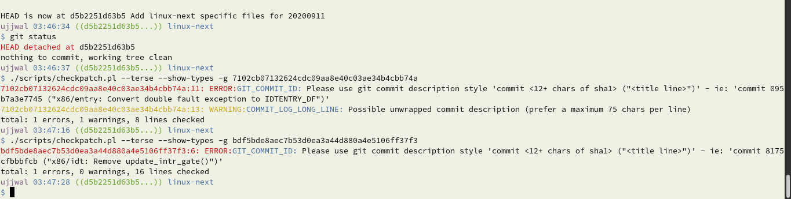
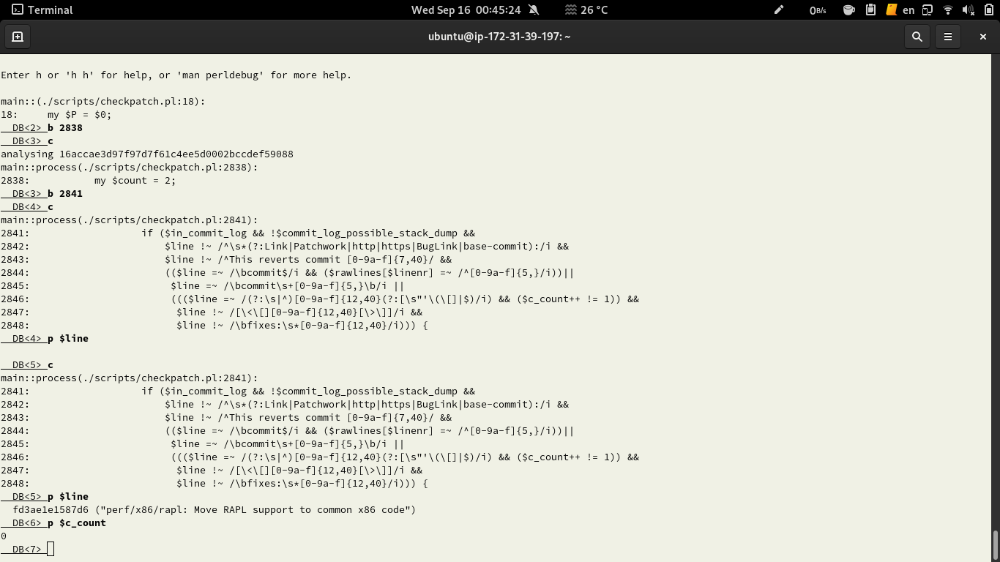
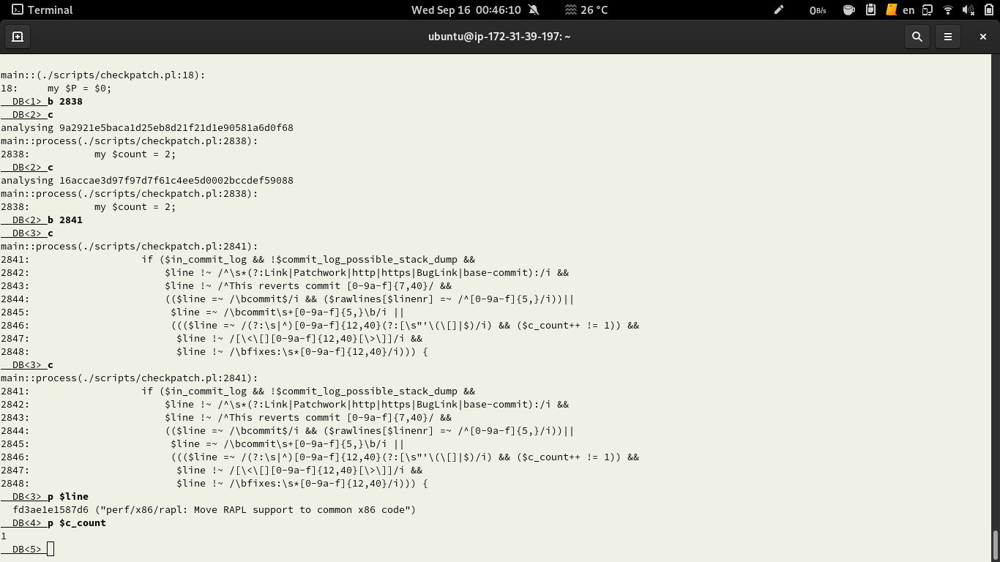
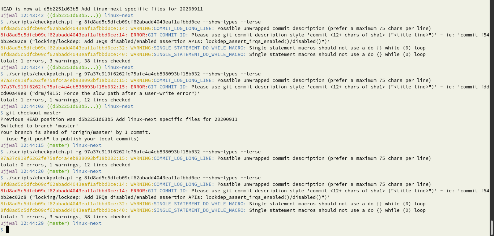

# Follow up task 2


> You state GIT_COMMIT_ID changed from 272 to 230, but the tester in
>
> https://lore.kernel.org/linux-kernel-mentees/CABJPP5BFNjBhdcvBWqDYnR-o2sZ0oY77bYr9PxducXW4Y=482Q@mail.gmail.com/
>
> claimed that it changed from 270 to 251.

<br>

- Which numbers are right? Why is there a difference in both statistics?

I ran both the scripts (mine and Dwaipayan's) and yes, there is a difference in the counts. This is because the patch has a bug which is triggered in some situations.

Below is a [comparison](#before-patch) of lists of commits with GIT_COMMIT_ID errors generated by the two scripts

A [solution](#solution) to the bug in the patch.

<br>

### **Before patch**

**COMMITS ONLY IN Dwaipayan's STATS - (count:0)**
```
$ comm -3 -1 workingdir/checkpatch_result_commits upstream/checkpatch_out_commits.txt 
$
```
<br>

**COMMITS ONLY IN MY STATS - (count:2)**
```
$ comm -3 -2 workingdir/checkpatch_result_commits upstream/checkpatch_out_commits.txt 
7102cb07132624cdc09aa8e40c03ae34b4cbb74a:11
bdf5bde8aec7b53d0ea3a44d880a4e5106ff37f3:6
```

I'm still not sure why these are different. So, I cross checked by running the script (w/o patch) individually on the commits and it does give an error (see below).



<br>

### **After patch**
**COMMITS ONLY IN Dwaipayan's STATS - (count:24)**

```
$ comm -3 -1 workingdir_patched/checkpatch_result_commits upstream/pcheckpatch_out_commits.txt

16accae3d97f97d7f61c4ee5d0002bccdef59088:8
16d598030a37853a7a6b4384cad19c9c0af2f021:6
19ce2321739da5fc27f6a5ed1e1cb15e384ad030:12
1b66d253610c7f8f257103808a9460223a087469:6
2d3a36a47964371101d9a71691c18d59ee611e87:6
30ce434e44d7e142e7a36c6b3eb2545adf692c67:16
3194915486b2bc3f77745774f1731b78f32ff688:6
3b4b19721ec652ad2c4fe51dfbe5124212b5f581:6
3dbf1ee6abbb30d21db0649b93a34576da64ab00:11
62ca18a0896f5590806e6aee7bce39f130a2d9d5:11
7b16994437c7359832dd51d66c5c387995a91438:7
835d1c3a98799914db8aee0973018af21128cd1e:6
a148866489fbe243c936fe43e4525d8dbfa0318f:6
ab93a4bc955b3980c699430bc0b633f0d8b607be:8
ad6d94f24f2024178bf71d126e93813dddde5ee4:6
bb5570ad3b54e7930997aec76ab68256d5236d94:11
bf12fdf0ab728ca8e5933aac46dd972c0dd0421e:6
bf7bc1df30f6c6afa34d4d1d53e1c8ad93510d3e:6
c3aaf086701d05a82c8156ee8620af41e5a7d6fe:6
d6ee6529436a15a0541aff6e1697989ee7dc2c44:9
de308d1815c9e8fe602a958c5c76142ff6501d75:8
e289f03ea79bbc6574b78ac25682555423a91cbb:69
e6da0edc24eecef2f6964d92fa9044e1821deace:7
fd52a75ca3545c965ff58a78b6ff0b0dc7d8d228:8
```

<br>

**COMMITS ONLY IN MY STATS - (count:3)**
```
$ comm -3 -2 workingdir_patched/checkpatch_result_commits upstream/pcheckpatch_out_commits.txt 

7102cb07132624cdc09aa8e40c03ae34b4cbb74a:11
97a37c919f6262fe75afc4a4eb838093bf18b032:15
bdf5bde8aec7b53d0ea3a44d880a4e5106ff37f3:6
```

After applying the below changes, the results come out to be 253 ERRORS after patch and 272 ERRORS before patch.

<br><br>

## Solution

For debugging, I added an extra if-condition (at lines 2837-2839) to skip through some loops.

Value of `$c_count` when run with commit `-g 16accae3d97f97d7f61c4ee5d0002bccdef59088`


<br>

Value of `$c_count` when run with commits '`-g 16accae3d97f97d7f61c4ee5d0002bccdef59088 9a2921e5baca1d25eb8d21f21d1e90581a6d0f68`'


Processing a particular type of commit (I found 9a2921e5baca1d25eb8d21f21d1e90581a6d0f68 as an example commit) leaves this variable's value as 1. And hence that creates a wrong behaviour of the script.

So the changes introduced in the patch from Ayush needs to reset the value to 0 before processing next commit as shown in the diff below.

```diff
diff --git a/scripts/checkpatch.pl b/scripts/checkpatch.pl
index 42de3939a445..058415172efc 100755
--- a/scripts/checkpatch.pl
+++ b/scripts/checkpatch.pl
@@ -1084,6 +1084,7 @@ for my $filename (@ARGV) {
        if (!process($filename)) {
                $exit = 1;
        }
+       $c_commit = 0;
        @rawlines = ();
        @lines = ();
        @fixed = ();
```

<br>

---

<br>

Can you share the errors that have changed after the patch was applied?

## One

- Which cases of GIT_COMMIT_ID have **disappeared**?

  - word "commit" is last, one line desc
  - "Depends-on" type of errors
  - hash followed by line break, one line desc
  - "References" type of errors
    - But the patched script still shows error for some commits, e.g. `8fd8ad5c5dfcb09cf62abadd4043eaf1afbbd0ce` while it doesn't for the commit `97a37c919f6262fe75afc4a4eb838093bf18b032`




<br>

### List of commits that dissappeared (reds)/changed

```diff
$ comm -3 -2 /tmp/oldlist /tmp/newlist
-064c73afe7385de99e5b2785b88c83dc5d84403b:12
-0828137e8f16721842468e33df0460044a0c588b:14
-0ae705f3d2b22d9d762f67fd49aa6c290987c6a3:7
-0b22c25e1b81c5f718e89c4d759e6a359be24417:16
-0b987032f8b58ef51cc8a042f46cc0cf1f277172:18
1c9df907da83812e4f33b59d3d142c864d9da57f:11
-1ca0c2f612116a7159ab11c36b555910f90db338:7
33d077996a87175b155fe88030e8fec7ca76327e:37
-4557ac6b344b8cdf948ff8b007e8e1de34832f2e:12
-490705888107c3edf8c264ec930909107f76a984:10
568e4e82128aac2c62c2c359ebebb6007fd794f9:9
-68cda40d9f3c4cb880108eb22f974d9e3d5dc6c5:26
69d67b461a180144ad1d31174fadf3e3eda78e56:12
-6f8b12d661d09b488b9ac879b8eafbd2cc4a1450:12
-97a37c919f6262fe75afc4a4eb838093bf18b032:15
-ad0f75e5f57ccbceec13274e1e242f2b5a6397ed:29
-ba8c90c6184784b397807b72403656085ac2f8c1:20
-bcf41dc480b179bfb669a232080a2e26dc7294b4:36
-bcf41dc480b179bfb669a232080a2e26dc7294b4:38
be01e8e2c632c41c69bb30e7196661ec6e8fdc10:9
-c3dbe541ef77754729de5e82be2d6e5d267c6c8c:9
-da785a87787c97823d12107a4f0ec7adcc2a78d9:9
-e0a851fe6b9b619527bd928aa93caaddd003f70c:17
-e575fb9e76c8e33440fb859572a8b7d430f053d6:8
e7a79811d0db136dc2d336b56d54cf1b774ce972:87
-e9e4ef9116b12951eaee3f8447ba9bbb40ab3620:8
-e9e81b634303b215e83beced03f04f02f7893442:7
f531c1b5de65bc687bdcca69e7649fe2db5b6d87:32
f743061a85f5e9989df22ccbf07c80c98fc90e08:13
```

<br>

## Two

- Which cases of GIT_COMMIT_ID are **new**?

  - word "commit" is last, hash on new line, no description

<br>

### List of commits with new (greens)/changed errors

```diff
$ comm -3 -1 /tmp/oldlist /tmp/newlist
1c9df907da83812e4f33b59d3d142c864d9da57f:10
33d077996a87175b155fe88030e8fec7ca76327e:36
568e4e82128aac2c62c2c359ebebb6007fd794f9:8
+5fdbe136ae19ab751daaa4d08d9a42f3e30d17f9:9
69d67b461a180144ad1d31174fadf3e3eda78e56:11
be01e8e2c632c41c69bb30e7196661ec6e8fdc10:8
e7a79811d0db136dc2d336b56d54cf1b774ce972:86
+ebf57440ec59a36e1fc5fe91e31d66ae0d1662d0:7
f531c1b5de65bc687bdcca69e7649fe2db5b6d87:31
f743061a85f5e9989df22ccbf07c80c98fc90e08:12
```

## Three

- Which cases of GIT_COMMIT_ID have **changed**?

  - word "commit" is last, desc is in >1 line
  - word "commit" is last, desc in 1 line, desc without quotes
  - desc in >1 line

## Four

- Have cases of **other type** of errors/warnings/checks/notes disappeared, been added or changed?

  - None. Below is the diff of stats file

    ```diff
    --- /tmp/oldstats
    +++ /tmp/newstats
    @@ -3,7 +3,7 @@
        904 ERROR:TRAILING_WHITESPACE
        660 ERROR:COMPLEX_MACRO
        342 ERROR:CODE_INDENT
    -    272 ERROR:GIT_COMMIT_ID
    +    253 ERROR:GIT_COMMIT_ID
        120 ERROR:TRAILING_STATEMENTS
        109 ERROR:POINTER_LOCATION
        36 ERROR:GLOBAL_INITIALISERS
    @@ -186,8 +186,8 @@
        322             207             TYPO_SPELLING                           
        294             268             BAD_SIGN_OFF                            
        286             286             NO_AUTHOR_SIGN_OFF                      
    -	272             222             GIT_COMMIT_ID                           
        256             47              CAMELCASE                               
    +	253             206             GIT_COMMIT_ID                           
        245             24              AVOID_EXTERNS                           
        239             23              MACRO_ARG_REUSE                         
        167             5               LOGICAL_CONTINUATIONS                   
    @@ -304,7 +304,7 @@
        1               1               ALLOC_ARRAY_ARGS                        
    
    
    -Total ERRORS:	4757
    +Total ERRORS:	4738
    Total WARNINGS:	26991
    Total CHECKS:	16710
    

    ```
