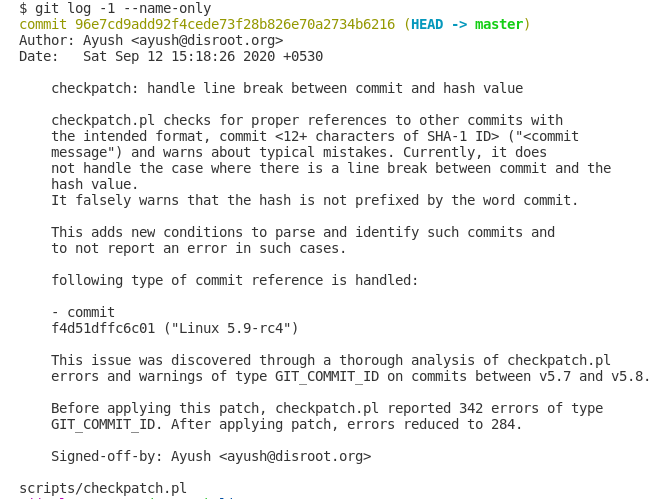
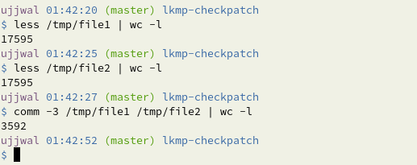
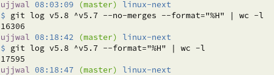

# Follow up task 1

The tasks are:

1. Run your scripts and create a full statistics of all error types with
their according count for v5.7..v5.8.

    * Full statistics excluding merge commits are available in [file here](workingdir/stats)
    * Full statistics including merge commits are available in [file here](workingdir/stats_with_merge_commits)
    * Full length output of script for each commit is available in [directory here](workingdir/reports/).

2. Apply the patch with git am.

    Applying patch <br>

     <br><br>

    Git log after applying patch <br>

    


3. Run your scripts again and create a new statistics.

    * Full statistics excluding merge commits are available in [file here](workingdir_patched/stats)
    * Full statistics including merge commits are available in [file here](workingdir_patched/stats_with_merge_commits)

4. Compare before and after

    * Compare without including merge commits <br>
    **272** ERROR:GIT_COMMIT_ID - (*before patch*)<br> 
    **230** ERROR:GIT_COMMIT_ID - (*after patch*)

    * Compare including merge commits <br>
    **304** ERROR:GIT_COMMIT_ID - (*before patch*) <br>
    **257** ERROR:GIT_COMMIT_ID - (*after patch*)

<br>

---

> Ujjwal, I can see that your evaluation shows
> 
> 272 ERROR:GIT_COMMIT_ID


## Clarification
Author's stats [reference](https://github.com/eldraco19/evalute_improve_checkpatch_pl/blob/master/STATS.md)<br>
The author mentioned as follows
> *checkpatch.pl on commits from v5.7 to v5.8 (Total 17595 commits)*

and used the following command to run the script
> ```
> # Running checkpatch on commits from v5.7 to v5.8
> scripts/checkpatch.pl -g bcf876870b95-17595 --show-types | grep -o "ERROR:.*:" | cut -d':' -f 2 > file.txt
> ```

Summary, we both ran the script on different set of commits. The part **'-g cf876870b95-17595'** and **'-g v5.7..v5.8'** run the script on ***same number of commits but completely different sets***. Hence the incosistency in the two statistics.
<br><br>

### Where's the difference
I collected commits as follows

> // total count of commits: 17595<br>
> git log v5.7..v5.8 --format="%H" | sort > file1

and 
> // total count of commits: 17595<br>
> git log v5.8 -17595 --format="%H" | sort > file2

and checked the difference

> $ com -3 file1 file2 | wc -l



### Facts
The count of commits from v5.7..v5.8 is 16306 excluding the merge commits<br>
The count of commits from v5.7..v5.8 is 17595 including the merge commits




**My new statistics taking the merge commits into consideration is [available here](workingdir/stats_with_merge_commits).**

